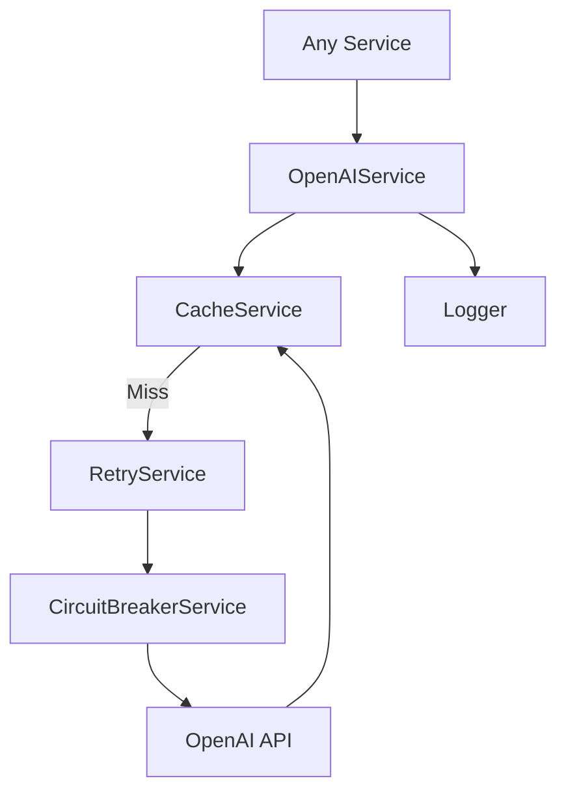

```mermaid
graph TD;
    AnyService["Any Service"] --> OpenAIService["OpenAIService"];
    OpenAIService --> CacheCheck["CacheService"];
    CacheCheck -->|Miss| Retry["RetryService"];
    Retry --> CircuitBreaker["CircuitBreakerService"];
    CircuitBreaker --> API["OpenAI API"];
    API --> CacheCheck;
    OpenAIService --> Logger["Logger"];
```