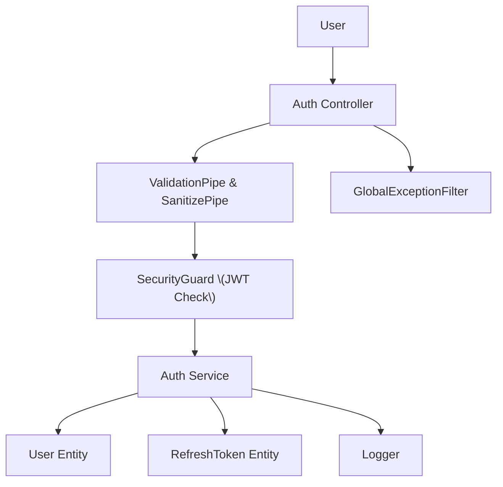

```mermaid
graph TD;
    User[User] --> AuthController["Auth Controller"];
    AuthController --> Validation["ValidationPipe & SanitizePipe"];
    Validation --> Guard["SecurityGuard \(JWT Check\)"];
    Guard --> AuthService["Auth Service"];
    AuthService --> UserEntity["User Entity"];
    AuthService --> RefreshToken["RefreshToken Entity"];
    AuthService --> Logger["Logger"];
    AuthController --> GlobalErrors["GlobalExceptionFilter"];

```