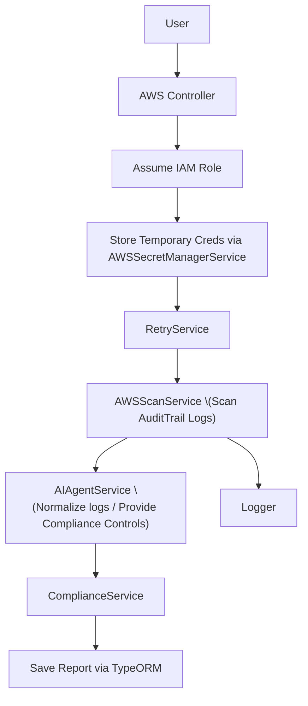

```mermaid
graph TD;
    User[User] --> AWSController["AWS Controller"];
    AWSController --> AssumeRole["Assume IAM Role"];
    AssumeRole --> TempCreds["Store Temporary Creds via AWSSecretManagerService"];
    TempCreds --> Retry["RetryService"];
    Retry --> AWSScan["AWSScanService \(Scan AuditTrail Logs)"];
    AWSScan --> AIAgent["AIAgentService \(Normalize logs / Provide Compliance Controls)"]
    AIAgent --> Compliance["ComplianceService"];
    Compliance --> DB["Save Report via TypeORM"];
    AWSScan --> Logger["Logger"];
```