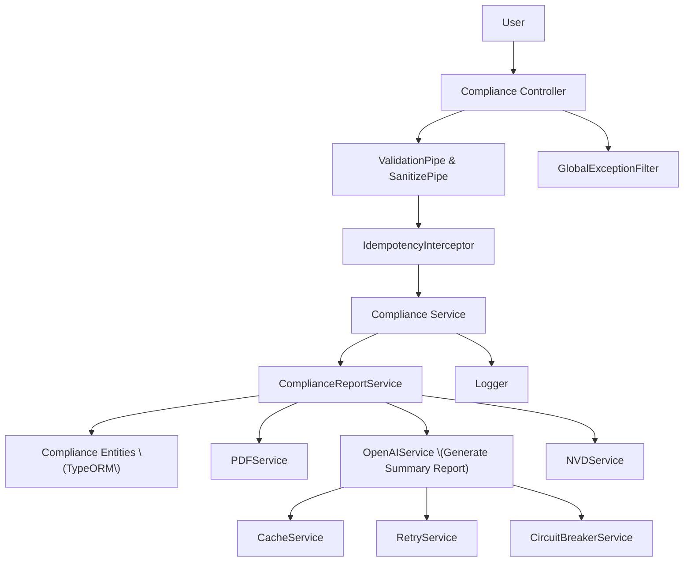

```mermaid
graph TD;
    User[User] --> Controller["Compliance Controller"];
    Controller --> Validate["ValidationPipe & SanitizePipe"];
    Validate --> Idempotency["IdempotencyInterceptor"];
    Idempotency --> ComplianceService["Compliance Service"];
    ComplianceService --> ReportService["ComplianceReportService"];
    ReportService --> DB["Compliance Entities \(TypeORM\)"];
    ReportService --> PDF["PDFService"];
    ReportService --> OpenAI["OpenAIService \(Generate Summary Report)"];
    ReportService --> NVD["NVDService"];
    OpenAI --> Cache["CacheService"];
    OpenAI --> Retry["RetryService"];
    OpenAI --> Circuit["CircuitBreakerService"];
    ComplianceService --> Logger["Logger"];
    Controller --> GlobalException["GlobalExceptionFilter"];
```