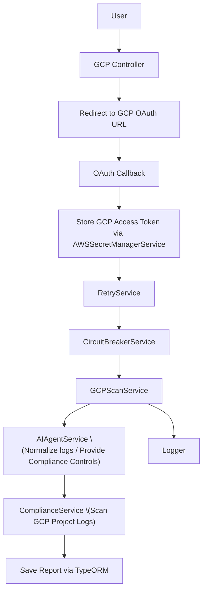

```mermaid
graph TD;
    User[User] --> GCPController["GCP Controller"];
    GCPController --> OAuth["Redirect to GCP OAuth URL"];
    OAuth --> Callback["OAuth Callback"];
    Callback --> Token["Store GCP Access Token via AWSSecretManagerService"];
    Token --> Retry["RetryService"];
    Retry --> Circuit["CircuitBreakerService"];
    Circuit --> GCPScan["GCPScanService"];
    GCPScan --> AIAgent["AIAgentService \(Normalize logs / Provide Compliance Controls)"]
    AIAgent --> Compliance["ComplianceService \(Scan GCP Project Logs)"];
    Compliance --> DB["Save Report via TypeORM"];
    GCPScan --> Logger["Logger"];
```