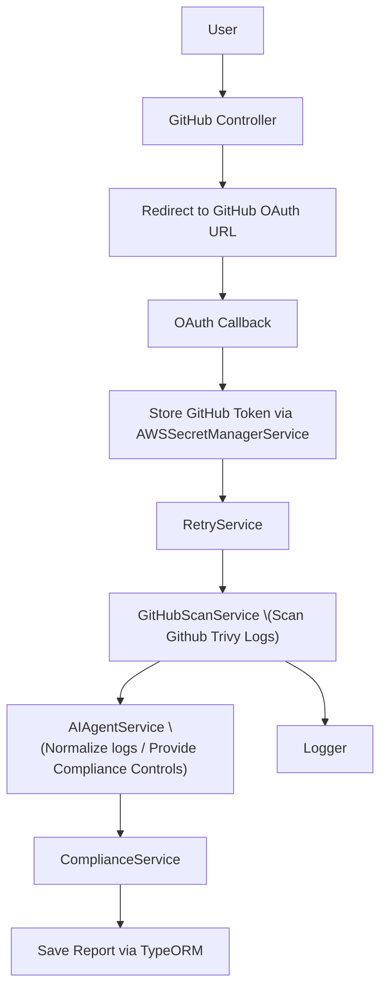

```mermaid
graph TD;
    User[User] --> GitHubController["GitHub Controller"];
    GitHubController --> OAuth["Redirect to GitHub OAuth URL"];
    OAuth --> Callback["OAuth Callback"];
    Callback --> Token["Store GitHub Token via AWSSecretManagerService"];
    Token --> Retry["RetryService"];
    Retry --> GitHubScan["GitHubScanService \(Scan Github Trivy Logs)"];
    GitHubScan --> AIAgent["AIAgentService \(Normalize logs / Provide Compliance Controls)"]
    AIAgent --> Compliance["ComplianceService"];
    Compliance --> DB["Save Report via TypeORM"];
    GitHubScan --> Logger["Logger"];
```